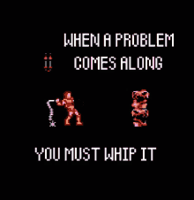

# Snes9x-Z

<p align="center"></p>

A performance-optimized fork of the [Snes9x](https://github.com/snes9xgit/snes9x) SNES emulator core. Bit-exact against upstream at commit [`7a8878f1`](https://github.com/snes9xgit/snes9x/commit/7a8878f1306f65594c30b7d86dee41d972c2e495) (2026-09-04), built around a from-scratch dual-core PPU rendering architecture. Mean measured gain: **+61.2% (x86-64) / +52.3% (arm64)** across a corpus of commercial games, every title positive on every run, on both platforms.

## What changed

- Removing redundant work from the hot rendering paths
- APU/DSP audio-pipeline fixes
- A dual-core PPU rendering architecture

## Correctness guarantee

Every change here is validated bit-exact against the original, unmodified Snes9x core: framebuffer and audio output are hashed at fixed intervals across full runs and must match upstream exactly, across every mode this fork adds. Not a "feels the same" claim, a byte-for-byte one.

## Measured performance

| ROM | x86-64 | arm64 |
|---|---:|---:|
| Jurassic Park | +98.4% | +77.8% |
| Donkey Kong Country | +78.5% | +77.6% |
| Radical Psycho Machine Racing | +63.1% | +69.4% |
| Star Fox | +65.0% | +63.8% |
| Super Mario World | +71.1% | +61.6% |
| F-Zero | +66.1% | +54.9% |
| GT Racing | +61.6% | +51.8% |
| Super Mario World 2 - Yoshi's Island | +61.8% | +48.9% |
| A.S.P. - Air Strike Patrol | +51.6% | +45.3% |
| Super Mario Kart | +55.3% | +45.2% |
| Aerobiz | +59.6% | +40.4% |
| Tiny Toon Adventures | +50.3% | +38.6% |
| Mega Man X2 | +51.7% | +37.0% |
| Winter Gold | +22.5% | +20.2% |

**Mean: +61.2% (x86-64) / +52.3% (arm64).** Every ROM positive on every repetition, on both platforms, measured in the same benchmark run (interleaved, ratio-of-means, statistically validated).

**Test environment:** 2x Intel Xeon E5-2690 v4 (28C/56T), Debian, GCC 12.2.0 (x86-64); Apple M4 Pro (14 cores), macOS, clang (arm64). Both built `-O3 -flto -DNDEBUG`, no `-march`, so there's no CPU-specific tuning and the gain is portable, not benchmark-rigged.

**Baseline:** compared against unmodified upstream Snes9x at commit [`7a8878f1`](https://github.com/snes9xgit/snes9x/commit/7a8878f1306f65594c30b7d86dee41d972c2e495) (2026-09-04), bit-identical to `snes9xgit/snes9x`. No cherry-picked or aged comparison point.

## Why it matters

More performance from the same hardware isn't just a bigger fps number. It's a resource you get to spend however you want:

- **Headroom for everything else**: shaders/filters, netplay, recording or streaming, or CPU-heavy tooling (TAS scrubbing, RL environments) running alongside the emulator without competing for cycles.
- **Cooler and quieter**: less CPU load means less thermal throttling and less fan noise on laptops and handhelds, at the same performance.
- **Playable on hardware that couldn't keep up before**: demanding games (coprocessor titles, hi-res/interlaced modes) that used to struggle now have room to spare.
- **Better economics at scale**: fewer CPU cycles per instance means more concurrent instances per server, relevant for cloud gaming, automated test farms, or bulk verification workloads.

This fork's actual design target was always low-power ARM handhelds, not desktop-class hardware. The numbers above hold on both ends of that spectrum.

## Pre-built binaries

Prefer not to compile it yourself? Pre-built cores for **Linux64, Windows64, Android arm64-v8a, Android armeabi-v7a, and macOS arm64** are available on the [Releases](../../releases) page.

## Building

```bash
# Linux64
make -C libretro clean && make -C libretro -j$(nproc)

# Windows64 (cross-compile; requires x86_64-w64-mingw32-gcc-posix/g++-posix)
make -C libretro clean && make -C libretro platform=win \
  CC=x86_64-w64-mingw32-gcc-posix CXX=x86_64-w64-mingw32-g++-posix -j$(nproc)

# Android arm64-v8a (requires the NDK; NDK=/path/to/ndk if not at /usr/lib/android-ndk)
make -C libretro clean && make -C libretro platform=android-arm64 -j$(nproc)

# Android armeabi-v7a
make -C libretro clean && make -C libretro platform=android-arm -j$(nproc)
```

Drop the resulting core into RetroArch's `cores/` directory, **and** the `.info` file below into its separate `info/` directory. RetroArch keeps the two apart; the core picker's display name, category and file-extension association come from the `.info` file, not the core binary itself. Save this as `snes9x-Z_libretro.info`:

```ini
display_name = "Nintendo - SNES / SFC (Snes9x-Z)"
authors = "Snes9x Team|snes9x-Z fork"
corename = "Snes9x-Z"
supported_extensions = "smc|sfc|swc|fig|bs"
categories = "Emulator"
license = "Snes9x License (non-standard, see LICENSE)"
permissions = ""
database = "Nintendo - Super Nintendo Entertainment System"
manufacturer = "Nintendo"
systemname = "Super Nintendo Entertainment System"
systemid = "snes"
```

Without it, RetroArch can still load the core manually (Load Core → browse to the file), just without the friendly name/auto-detection.

## License

Non-commercial, personal use. See `LICENSE`. Same terms as upstream Snes9x, plus this fork's own copyright for the work described above.

---

**Methodology:** built with AI-assisted engineering, human-in-the-loop at every step, never an autonomous pipeline. Completed in 3 days. The orchestration and tooling behind this process are proprietary. Total cost: under $30 in LLM usage.

Source is provided stripped of internal comments and process history. The results are bit-exact against upstream and the numbers above are reproducible. That's the proof, not an explanation of how it was built. Questions about the process are welcome, via interview.

I specialize in deep-tech performance engineering, multi-core architecture, and applying AI-assisted engineering to legacy, compute-bound problems. Available for high-level architecture and infrastructure roles.

**André Zaiats**: [linkedin.com/in/azaiats](https://www.linkedin.com/in/azaiats/)

**Luiz Zaiats**: [linkedin.com/in/lzaiats](https://www.linkedin.com/in/lzaiats), macOS/arm64 platform support and performance validation
